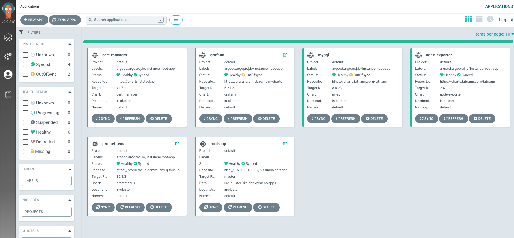
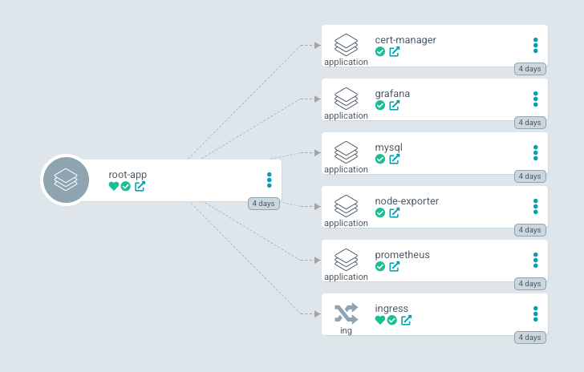
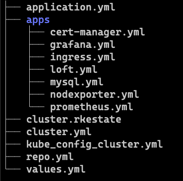
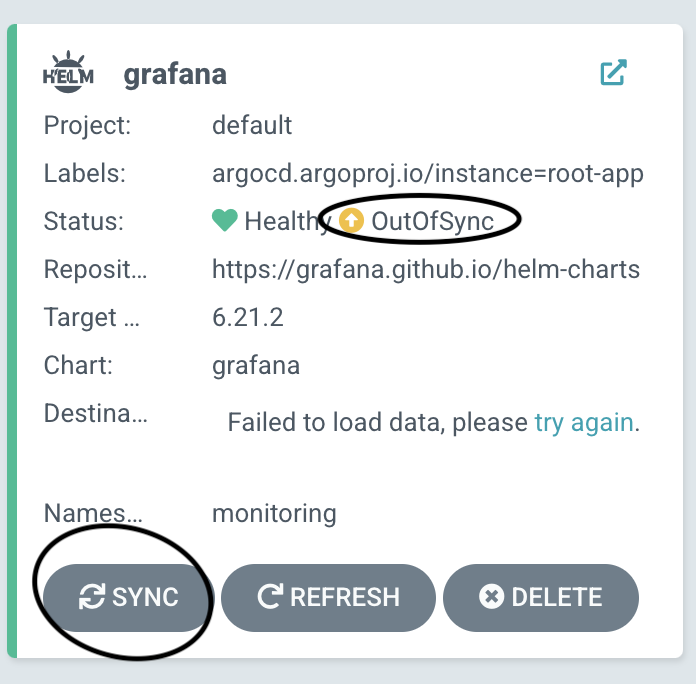

# Manage your Kubernetes cluster with ArgoCD

- This document written according to Kubernetes that was deployed on RKE, but can be deployed on any other Kubernetes platform like minikube, k3d, AWS EKS, Azure AKS, etc.

Little introduction about GitOps and ArgoCD is detailed on [this page](https://github.com/nissimuseri/Documentations/blob/main/ArgoCD.md).

Deploying ArgoCD with your Kubernetes cluster is separate to two main steps:

- Installation of ArgoCD on the cluster
- Install miniservices of your application as ArgoCD Application

## Step 1 - ArgoCD Installation

There are many ways to install ArgoCD on your cluster, all are mentioned on [ArgoCD documentation](https://argo-cd.readthedocs.io/en/stable/getting_started/).

I choose to deploy it with Helm.

Helm is a package manager to Kubernetes, you can read more about its capabilities and benefits [here](https://github.com/nissimuseri/Documentations/blob/main/Helm.md).

1. Add argo repo to your repositories:

```bash
helm repo add argo https://argoproj.github.io/argo-helm
```

1. Install the release from the imported repo:

You can also add `values.yml` file as configuration file to add more definitions like adding ingress or `--insecure` configuration for accessing ArgoCD on HTTP(not secure).

The full command will be:

```bash
helm install argocd argo/argo-cd --namespace argocd --create-namespace --values values.yml
```

argocd = release name.
argo/argo-cd = helm chart name.
--namespace argocd  --create-namespace = create namespace for argo
--values values.yml - pass the configuration file

The configuration file for access ArgoCD in insecure(HTTP) looks like:

```yaml
server:
    extra_args:
    - --insecure
```

Once the ArgoCD was installed, check the Kubernetes resources for `argocd` namespace are up:

```bash
kubectl get all -n argocd
```

For accessing the ArgoCD GUI via browser, do port forward to the service of the server:

```bash
kubectl port-forward svc/argocd-server -n argocd 8080:80
```

Now, try to access via: [http://localhost:8080](http://localhost:8080)

You can get the initial password for the admin with this command:

```bash
kubectl -n argocd get secret argocd-initial-admin-secret -o jsonpath="{.data.password}" | base64 -d
```

Once you have get into the ArgoCD UI, we can go forward with the second step, and deploy GitOps with our Kubernetes cluster.



## Step 2 - Install Applications on ArgoCD

As step 1, also here there are more than one way to install and deploy ArgoCD applications.

We use in our cluster the AppOfApps methodology, you can read more about it [here](https://argo-cd.readthedocs.io/en/stable/operator-manual/cluster-bootstrapping/).





**application.yml -** this is the main/root app, which deploy all the services as a one repo.

**apps -** this is the repo, where we save all the yml files(not only Application.yml) which need to be deployed on our cluster.

### Application.yml & Apps folder

`Application` is a Kubernetes CRD which comes with the installation of ArgoCD.

On this file we are take one Git repository and sync our Kubernetes cluster to compare the diff between the current state to the desired state.

Get more information about GitOps with [this video](https://www.youtube.com/watch?v=MeU5_k9ssrs).

In our cluster, we are use the `App of Apps` concept to deploy many applications in one shot.

Get more information about this concept [here](https://argo-cd.readthedocs.io/en/stable/operator-manual/cluster-bootstrapping/).

Our `application.yml` is looks like:

```yaml
apiVersion: argoproj.io/v1alpha1
kind: Application
metadata:
  name: root-app
  namespace: argocd
  finalizers:
  - resources-finalizer.argocd.argoproj.io
spec:
  destination:
    namespace: default
    server: https://kubernetes.default.svc
  project: default
  source:
    path: rke_cluster/rke-deployment/apps
    repoURL: http://192.168.132.27/nissimm/personalrepo.git
    targetRevision: master
  syncPolicy:
    automated:
      selfHeal: true
```

For deploying an ArgoCD application, you need to apply the Kubernetes manifest with `kubectl apply`.

```bash
kubectl apply -n argocd -f application.yml
```

Now, the application will be deployed on ArgoCD.

Because we have deployed the `root-app` , the nested apps(inside the `apps` folder), all the other Apps will be deployed also, as part of the parent app(App Of Apps concept).

### Repo.yml

I am using here a private repo, so I need to pass credentials as a Kubernetes Secret on the `repo.yml` file as an additional app.

The deploying of this Secret file, should be **before** the deploying the `root-app` for getting access to the repo.

```bash
kubectlapply -n argocd -f repo.yml
```

### ingress.yml

As regular ingress.yml Kubernetes manifest, it gives us a way to access the cluster with DNS, instead of port-forward to the local IP.

In our case, we are using such as internal DNS for our local machine, so we just edited the `/etc/hosts` file.

On other projects it could be some external DNS service.

The `/etc/hosts/` looks like:

```bash
➜ cat /etc/hosts
##
# Host Database
#
# localhost is used to configure the loopback interface
# when the system is booting.  Do not change this entry.
##
127.0.0.1	localhost
255.255.255.255	broadcasthost
::1             localhost
192.168.83.18	argocd.cluster.local
192.168.83.18	grafana.cluster.local
192.168.83.18	prometheus.cluster.local
192.168.83.18	loft.cluster.local

# Added by Docker Desktop
# To allow the same kube context to work on the host and the container:
127.0.0.1 kubernetes.docker.internal
# End of section
```

I just added each `[APP].cluster.local` to the same worker node in my cluster.

The `ingress.yml` file is transfer the data to the relevant destination on layer 7.

```yaml
apiVersion: networking.k8s.io/v1
kind: Ingress
metadata:
  name: ingress
  namespace: argocd
spec:
  ingressClassName: nginx
  rules:
  - host: argocd.cluster.local
    http:
      paths:
      - path: /
        pathType: Prefix
        backend:
          service:
            name: argocd-server
            port:
              number: 80
```

In my example, the ingress is for the ArgoCD server.

For other Application, we just pass the values for the ingress inside the `application.yml` of the specific service.

For example, this is my `loft.yml`

```yaml
apiVersion: argoproj.io/v1alpha1
kind: Application
metadata:
  name: loft
  namespace: argocd
  finalizers:
  - resources-finalizer.argocd.argoproj.io
spec:
  destination:
    namespace: argocd
    server: https://kubernetes.default.svc
  project: default
  source:
    repoURL: https://charts.loft.sh/
    targetRevision: v2.1.2
    chart: loft
    helm:
      values: |
        admin:
          email: nissim.museri@cellwize.com
          password: admin
        ingress:
          enabled: true
          host: loft.cluster.local
```

All the values are according to the values of the helm chart.

### Auto Sync:

There are many work methods for Continues Delivery/Deployment for making the level of automation in your CD.

In our cluster, we preferred to make the root-app with auto sync, but the nested apps are not.

This method gives us the capability to push the changes from our Git repo directly to our ArgoCD as the platform of the deployment in our organization, but enforce the administrator to do the last click for deploying the changes.

We just added this to the root application yaml file(as we also can see in the code section above).

```yaml
  syncPolicy:
    automated:
      selfHeal: true
```

There are many other methods, it is change according to the use-case of your organization.

For applying the changes, just `Sync` the specific ArgoCD Application.



Great, now you have a Kubernetes cluster which can be managed by ArgoCD operator and use GitOps methodology.

It is now simple to add more microservices for your cluster, and manage them in one place.
